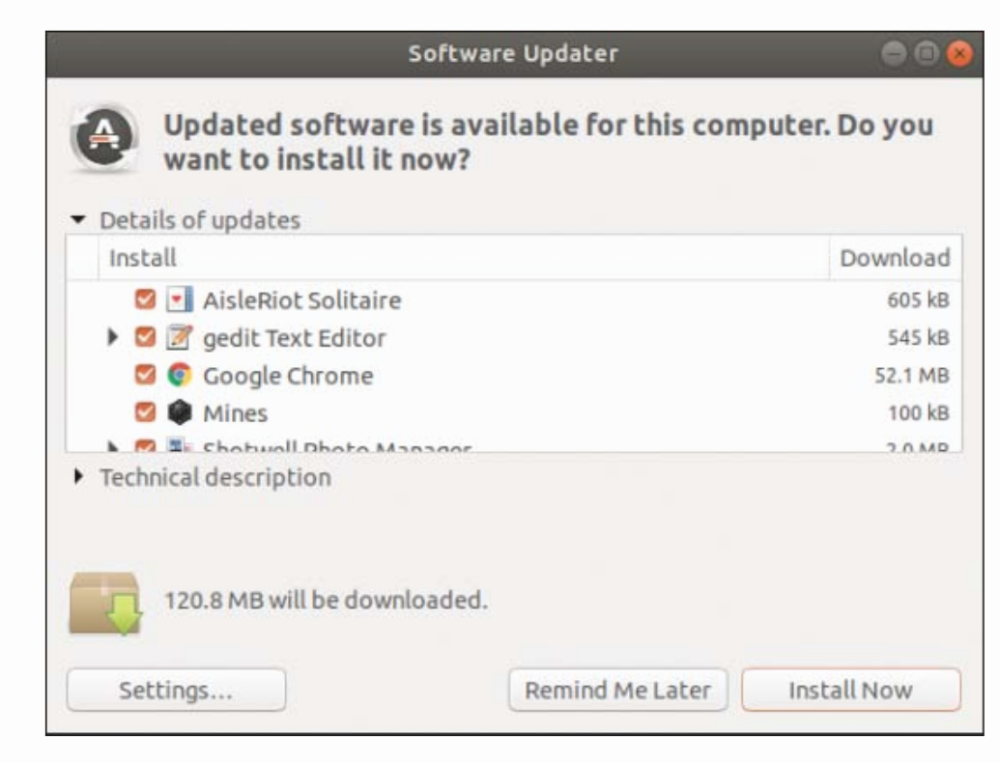
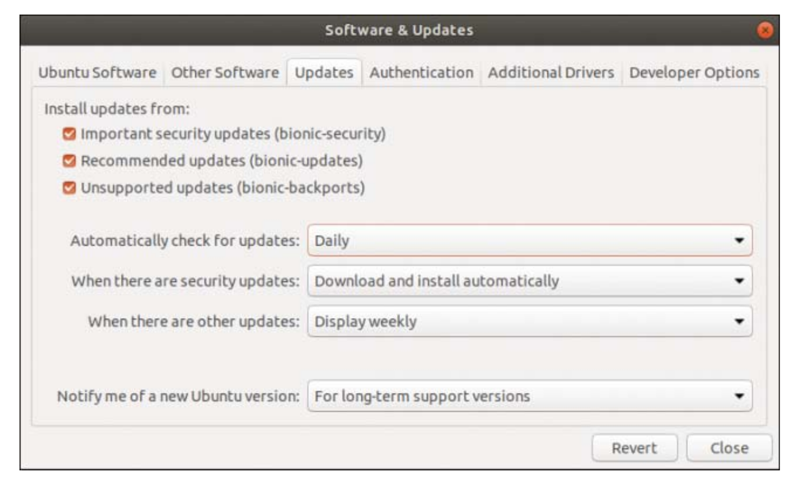
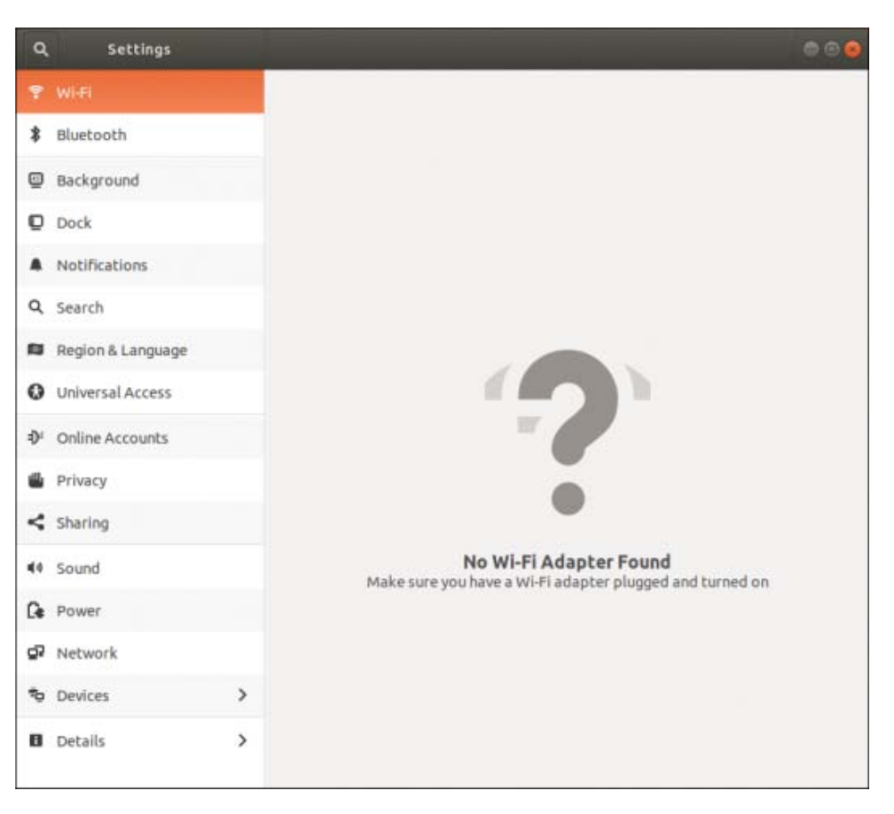

# بسم الله الرحمن الرحيم

## Ubuntu Downloads

<https://ubuntu.com/download>

- Ubuntu Desktop
- Ubuntu Server
- Ubuntu Cloud
- Ubuntu for IoT

## Official Ubuntu Flavors

<https://wiki.ubuntu.com/UbuntuFlavors>

- Ubuntu
- Ubuntu Server
- Ubuntu Budgie
- Kubuntu
- Xubuntu
- Edubuntu
- Mythbuntu
- Ubuntu Studio
- Lubuntu
- Ubuntu Kyvin

## Installation Methods

- DVD
  - Download the iso and burn the DVD
- Thumb
  - At least 2GB
  - For Windows
    - Universal USB Installer <http://www.pendrivelinux.com/universal-usb-installer-easy-as-1-2-3/>
    - ISO Recorder <http://isorecorder.alexfeinman.com/>
  - For Ubuntu
    - Startup Disk Creator
- Network Installation
- ISO

## 32-Bit Versus 64-Bit Ubuntu

- How a computer processor is able to register and use memory
- Computer with a 32-bit processor will be able to use a maximum of 4GB of memory
- Computer with a 64-bit processor will be able to use up to a theoretical limit of 17 billion GB
- i386: This supports all Intel or compatible processors except those that require AMD64, including current Apple hardware
- AMD64: If you know you are using a processor based on the AMD64 or EM64T architecture (for example, Athlon64, Opteron, EM64T Xeon, Core2), you should choose this version

## Planning Partiotion Strategies

- Preferable and common
- To plan the best partitioning scheme, research and know the answers to these questions:
  - How much disk space does your system require?
  - Do you expect your disk space needs to grow significantly in the future?
  - Will the system boot only Ubuntu, or do you need a dual-boot system?
  - How much data requires backup, and what backup system will work best?

## Boot Loader

- Ubuntu automaticall installs GRUB2 (Grand Unified Boot Loader) to the Master Boot Record (MBR) or to the GPT (GUID Partition Table)
- It detects any other operating systems, and adds entries in GRUB2
- DUAL-BOOT
  - Not recommended
  - Achievable
  - Install Windows first

## UEFI

- Hardware that is from 2010 or newer, it probably includes a firmware interface called UEFI
- The Unified Extensible Firmware Interface is a specification that defines how an operating system and the hardware interact
- It replaces the BIOS
- Some manufacturers continue to use the term BIOS, just for consistency over time, even when they are using UEFI
- It has also been known to cause problems when you try to install a different operating system than the default one it came with on one
of these machines
- The 64-bit version of Ubuntu has become more reliable in supporting
installation on these machines with each Ubuntu release
- If you encounter difficulties, see <https://help.ubuntu.com/community/UEFI> for assistance

## Step-by-Step Installation

- Backup your data
- You can even backup your entier Operating System current installation <http://clonezilla.org>
- Connect to a Power Supply
- Connect to the Internet

## Shutdown / Restart

`$ sudo shutdown -h now`
`$ sudo shutdown -r restart`

## Finding Programs and Files

## Software Updater

`$ sudo apt update`
Check for updates

`$ sudo apt full-upgrade`
Performs the updates, with dependencies installation (smart)

`$ sudo apt upgrade`
Recommended for servers, as it does not make major changes to software installations - Only Security and Simple Package Updates

## The `sudo` Command

- used in front of other commands
- Tell Ubuntu that we want to run the following command with super user powers
- Used to make wide-ranging changes to the system

`$ sudo passwd root`
`$ sudo -i`
`# `

## Configuring Software Repositories

- Ubuntu uses software repositories to get information about available software that can be installed
- Ubuntu Universe Repository
  - Debian packages are made available in Ubuntu's Universe repository
  - *Masters of the Universe (MOTUs)*
  - Enabled by default
- Software Updates GUI tool

The more boxes you check, the wider your selection of software. It is a good idea to make sure that the Properiety Devices box is checkedd so that you can benefit from drivers that might enhance system performance.

Backports: software that is released for a newer version of Ubuntu but reprogrammed to be compatible with the current release.

Some Ubuntu releases are called LTS, for long-term support, and are intended for production use by most people. The interim releases are for those who feel they must have the most recent version of everything or those who help work on Ubuntu development. These releases are stable, but they are supported for only a short time, so if you choose to use them, you should plan to upgrade to the new release every six months. By ensuring that the release upgrade option is set to LTS releases only, you’ll be prompted to upgrade your version of Ubuntu only every two years; the next LTS version, 20.04, is scheduled to be released in April 2020.

## System Settings

## Detecting and Configuring a Printer

<http://www.openprinting.org/printers>

## Configuring Power Management

## Setting the Time and Date

### Using the `date` Command

`$ date`

To adjust system's date to September 28, 2018 at 10:33 a.m.
`$ sudo date 092810332018`

### Using the `hwclock` Command

Use the `hwclock` command to display or set Lunix system time, display or set PC's hardware clock, or synchronize the system and hardware times.

`$ sudo hwclock --show`
`$ sudo hwclock --set --date "09/28/18 10:33:00"
`$ sudo hwclock --show`

To set the system time from PC’s hardware clock, use the `--hctosys` option
`$ sudo hwclock --hctosys`

To set hardware clock using the system time, use the `--systohc` option
`$ sudo hwclock --systohc`

## Configuring Wireless Networks

- SSID: Service Set Identifier
- Hidden Networks
- Cisco VPN `vpnc`

## Troubleshooting Post-Installation Configuration Problems

Ubuntu built-in error log: errors that don't affect the appearance of the sytem

`$ dmesg`

Commonly used with `grep` to filter out output. `dmesg` takes its output from `/var/log/messages`.
## Note 1:
Ubuntu no longer uses the `/var/log/messages` file by default. The same information is available in the file `/var/log/syslog` .

`$ less /var/log/messages`

`$ dmesg > dmesg.txt`
## Note 2 : 
Redirection symbols 
http://en.wikipedia.org/wiki/Redirection_%28computing%29

 - `>` "output to"
 - `>>` "append to"
 - `<` "input from"
 ### | "pipe"

`$ less dmesg.txt`

Making backups is important. Do not use `bak` extension because this might get overwritten by another application.

`$ cp dmesg.txt dmesg_bk.txt`

Suggestion: backupYYYYMMDD
