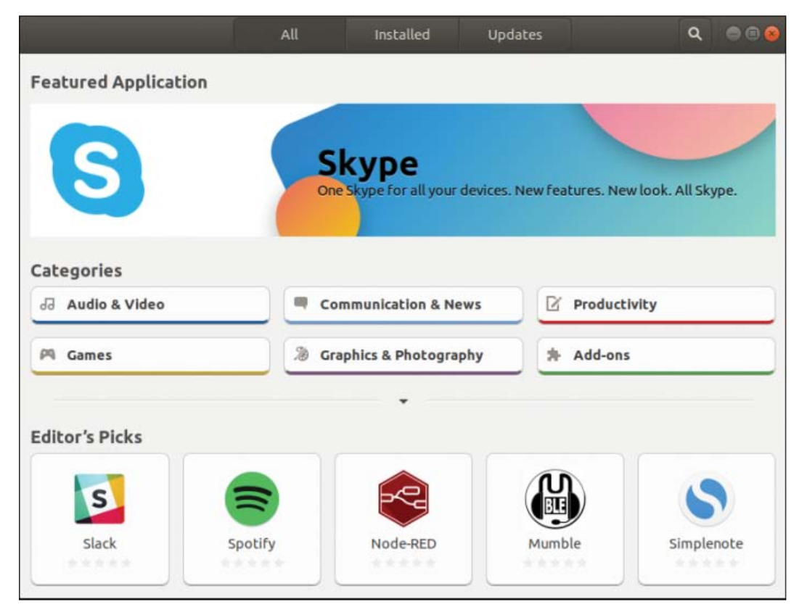
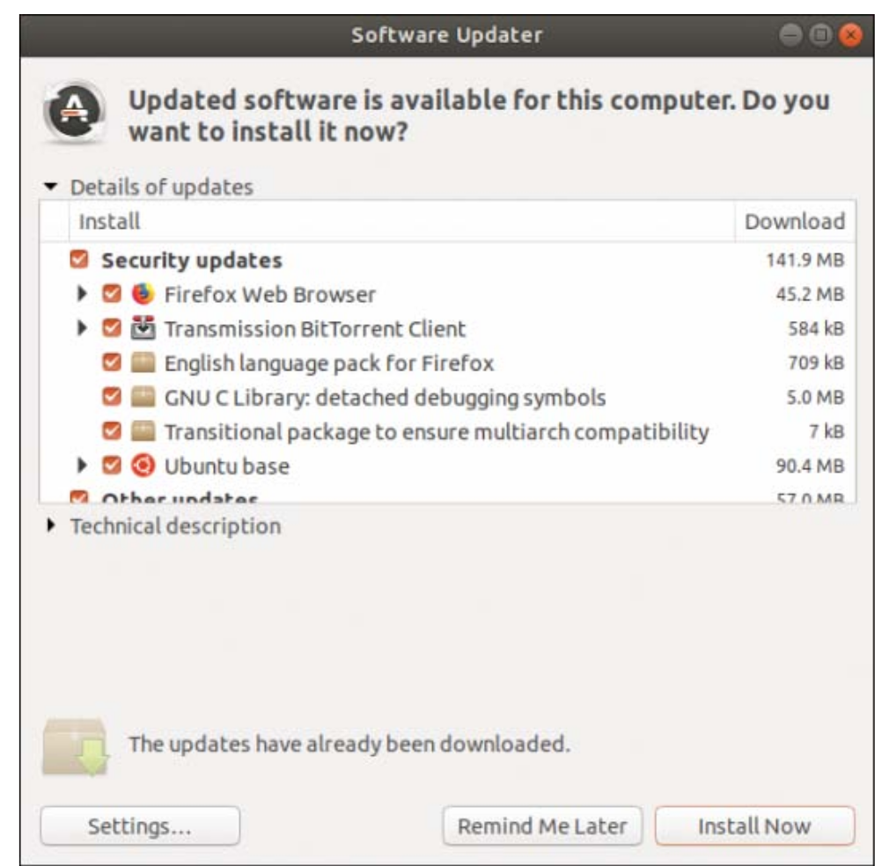

# بسم الله الرحمن الرحيم

## Managing Software

### Ubuntu Software

`$ ubuntu-software`

## Using Synaptic

- To install libraries
- Not installed by default
- Install it using Ubuntu Software

- **Unmark** — If you have marked the package for installation, upgrade, or one of the other options, this option removes that mark.
- **Mark for Re-installation** — If you have some software already installed, but for some reason it’s not working, click this option to reinstall it from scratch. Existing configuration files are retained, so any edits you have made are safe.
- **Mark for Upgrade** — If the software has updates available, select this option to download and install them.
- **Mark for Removal** — Select this option to delete the selected package from your system but leave its configuration files intact so that if you ever reinstall it, you do not have to reconfigure it.
- **Mark for Complete Removal** — Select this option to delete the selected package from your system and also remove any configuration files and purge everything from the system.

Beneath the categories on the left side of the screen are six buttons: Sections, Status, Origin, Custom Filters, Search Results, and Architecture. These customize the left list:

- Sections is the Categories view
- Status enables you to view packages that are installed or upgradable
- Origin lists the different repositories available to download packages
- Custom Filters has some esoteric groupings that are useful only to advanced users
- Search Results stores results of your searches
- Architecture shows the packages specific to each architecture of Ubuntu

To enable the Universe and Multiverse repositories, go to Settings, Repositories. This list shows all the servers you have configured for software installation and updates andincludes the Universe and Multiverse repositories. When you find them, check them and then click Close.

Note: enabling Universe Repository is highly recommended

## Staying Up-to-Date

## Working on the Command Line

### Advanced Package Tool (APT)

- First system to properly handle depencies 
- Redhat used RPM files that had dependencies (GIMP and GTK)
- APT was designed to automatically find and download dependencies for packages

#### Day-to-Day APT Usage

APT uses a local cache of the available packages to enable quick and thourough package search.

`$ sudo apt update`

Instructs APT to contact all servers it is configured to use and download the latest list of iles updates.

`$ sudo apt upgrade`

Note: `apt upgrade` never removes software or adds new software.

` sudo apt-get dist-upgrade`

Allow users to upgrade from one version of Debian/Ubuntu to a newer version

`$ sudo apt install mysql-server`

Note: recommended packages list include `mailx`. Cancel the installation, and run the command

`$ sudo apt install mysql-server mailx`

Note: APT maintains a package cache where it stores DEB files it has downloaded and installed. This usually lives in `/var/cache/apt/archives` and can sometimes take up many hundreds of megabytes on your computer. You can have APT clean out the package cache by running `apt-get clean` , which deletes all the cached DEB files. Alternatively, you can run `apt-get autoclean` , which deletes cached DEB files that are beyond a certain age and keeps newer packages.

`$ sudo apt remove firefox'

Removes firefox but leaves configuration files. Take care of removing dependencies that might be needed by other software. 

`$ sudo apt-get remove -purge firefox`
`$ sudo apt-get purge firefox`

Both are equal. Removes firefox and deletes configuration files (full unistall).

### Finding Software

Full-Text search (include Description)
`$ apt-cache search kde`

To search names only
`$ apt-cache -n search kde`

Mix with regular expressions. `^` represents the beginning, and `$` represents the end.

`$ apt-cache -n search ^kde`

`$ apt-cache search games | grep kde`

If we have found the package we want to install, and we want to get information about it, we use the command 

`$ apt-cache showpkg mysql-server-5.7`

### Using `apt` instead of `apt-get`

| `apt-get` | `apt` |
|--------|--------|
|`apt-get install`|`apt install`|
|`apt-get remove` |`apt remove`|
|`apt-get update`|`apt update`|
|`apt-get upgrade`|`apt upgrade`|
|`apt-get dist-upgrade`|`apt full-upgrade`|
|`apt-get remove --purge`| `apt purge`|
|`apt-get autoremove`|`apt autoremove`|
|`apt-get search`|`apt search`|
|`apt-get show`|`apt show`|
|`dpkg --get-selections`|`apt list --installed`|
|`apt-get purge`|`apt purge`|

## Compiling Software form Source