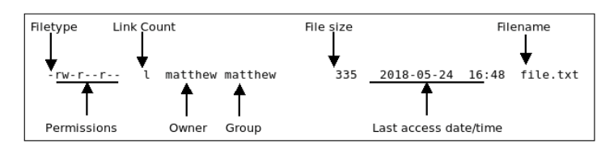

# بسم الله الرحمن الرحيم

[TOC]

## Command-Line Beginner's Class

- Powerful tool
- Computer System Administration and Maintenance
- aka
  - terminal
  - shell
  - console
  - command prompot
  - command line interface (CLI)

This chapter covers

- **Routine tasks** — Logging in and out, changing passwords, listing and navigating file directories
- **Basic file management** — Creating files and folders, copying or moving them around the file system, renaming and deleting them
- **Basic system management** — Shutting down or rebooting, changing file permissions, and reading man pages, which are entries for commands included as files already on your computer in a standardized manual format

## Accessing the Command Line

- Desktop menu option Terminal
- `$ gnome-terminal`
- ctrl + alt + t

### Virtual Consoles

ctrl + alt + F1

This is tty1, one of six virtual consoles that Ubuntu provides. After you have accessed a virtual console, you can use Ctrl+Alt+ any of F1 through F6 to switch to a different console, tty1 through tty6. If you want to get back to the graphical interface, press Ctrl+Alt+F7. You can also switch between consoles by holding the Alt key and pressing either the left or the right cursor key to move down or up a console, such as tty1 to tty2.

### Logging Out

`exit`
`logout`

## User Account

- Two types of people access the system as users
  - Regular User Account: can change anything that is specific to their accounts, such as personal preferences, configuration for a program whn it is un by them using their account. They can't make system wide changes
  - Super User: can make system-wide changes. With super user privileges, we have access to the entire system and can carry out any task.

`$ sudo rm -rf /` # Never execute this command unless you know what you are doing

### Root user account

- In traditional and older Linux systems
- Specific user account: root
- Super user account
- `$ su`

In Ubuntu

- root account is disabled by default

`$ sudo passwd`

`$ sudo -i`

## Reading Documentation

### Using Man Pages

To learn more about a command or program, use the `man` command followed by the name of the command. Man pages are stored in places like `/usr/share/man` and `/usr/local/share/man`.

`$ man rm`

`$ info rm` # Detailed information

### Using `apropros`

To find commands related to some task

`$ apropos partition`

`$ apropos count`

### Using `whereis`

To find a command and its documentation

`$ whereis fdisk`

## Understanding Linux File System Hierarchy

- Well-planned hierarchy
- Not perfect, but logical
- Mostly consistent

| Directory | Description |
|-----------|-------------|
| / | The root directory |
| /bin | Essential Commands |
| /boot | Boot loader files, Linux kernel |
| /dev | Device files |
| /etc | System configuration files |
| /home | User home directories |
| /lib | Shared libraries, kernel modules |
| /lost+found | Recovered files (if found after system check) |
| /media | Mount point for removable media, such as DVDs and floppy disks |
| /mnt | Usual mount point for local, remote file systems, file systems that are additional to the standard, such as a DVD-ROM or another HDD |
| /opt | Add-on software packages |
| /proc | Kernel information, process control |
| /root | Super user (root) home |
| /sbin | System commands (mostly root only) |
| /srv | Information relating to services that run on the system |
| /sys | Real-time information on devices used by the kernel |
| /tmp | Temporary files |
| /usr | Software not essential for system operation, such as applications

`$ man hier`

## Navigating the Linux File System

`$ ls`

`$ -a`

`$ ls -al`

`$ ls -R`

`$ ls -laR > listing.txt`

`$ cd Desktop`

`$ cd ..`

`$ cd $HOME`

`$ echo $HOME`

`$ cd ~`

`$ pwd`

## Working with Permissions

`$ touch file`

`$ ls -l file`

`ls` command reports on the file:

- **The type of file created** — Common indicators of the type of file are in the leading letter in the output. A blank (which is represented by a dash, as in the preceding example) designates a plain file, d designates a directory, c designates a character
device (such as /dev/ttyS0 ), and b is used for a block device (such as /dev/sda ).
- **Permissions** — Read, write, and execute permissions may be assigned for the owner, group, and all others on the system.
- **Number of links to the file** — The number 1 designates that there is only one file, and any other number indicates that there might be one or more hard-linked files. Links are created with the ln command. A hard-linked file is an exact copy of the
file, but it might be located elsewhere on the system. Symbolic links of directories can also be created, but only the root operator can create a hard link of a directory.
- **The owner** — This is the account that owns the file; it is originally the file creator,
but you can change this designation by using the chown command.
- **The group** — This is the group of users allowed to access the file; it is originally the
file creator’s main group, but you can change this designation by using the chgrp
command.
- **File size and creation/modification date** — The last two elements indicate the size of the file in bytes and the date the file was created or last modified.

### Assigning Permissions

Under Linux, permissions are grouped by owner, group, and others, with read, write, and execute permission assigned to each as follows

| Owner | Group | Others |
|-------|-------|--------|
| rwx | rwx | rwx |

- r
- w
- x

- 4
- 2
- 1

In Linux, you can create groups to assign a number of users access to common directo-
ries and files, based on permissions. You might assign everyone in accounting to a group
named accounting and allow that group access to accounts payable files while disallow-
ing access by other departments. Defined groups are maintained by the root operator, but
you can use the newgrp command to temporarily join other groups to access files (as long
as the root operator has added you to the other groups). You can also allow or deny other
groups’ access to your files by modifying the group permissions of your files.

### Directory Permissions

- Directories are also files under Linux

`$ mkdir directory`
`$ ls -ld directory`

`$ man ls`

`ls` command with `ld` option is used to show the permissions and other information about the directory (not its contents)

- r: read the directory
- w: write to the directory
- x: execute the content

`$ ls -l /dev/ttyS0` # Linux Serial Port

`$ ls -l /dev/sda`

### Altering File Permissions with `chmod`

`chmod`

- **u** — Adds or removes user (owner) read, write, or execute permission
- **g** — Adds or removes group read, write, or execute permission
- **o** — Adds or removes read, write, or execute permission for others not in a file’s group
- **a** —Adds or removes read, write, or execute permission for all users
- **r** — Adds or removes read permission
- **w** — Adds or removes write permission
- **x** — Adds or removes execution permission

`$ touch readme.txt`

`$ chmod a-w readme.txt`

`$ ls -l readme.txt`

`$ chmod 600 readme.txt`

`$ ls -l readmentxt`

### File Permissions with `umask`

`$ umask`

Numbers defined in `umask` are subtracted from the ultimate file permissions. If we want all new files to be created with a default permission of 777, we would type

`$ umask 000`

Note: We subtract from 666 -

### File Permissions with `chgrp`

`$ chgrp sudo filename`

To display groups

`$ groups`

### File Permissions with `chown`

`$ chown helghareeb:sudo filename`

## Working with Files

### `touch`

### `mkdir`

### `rmdir`

### `rm`

`$ rm file1 file2 file3`

`$ rm -rf <dir>`

`$ rm -R <dir>`

### `mv`

### `cp`

### `cat`

### Wildcards and Regular Expressions

## Deleting Users

`$ sudo deluser --remove-all-files --remove-home ITI`

## Shutting Down the System

`$ sudo shutdown -h now`

`$ sudo shutdown -h 0`

`$ sudo shutdown -r now`
