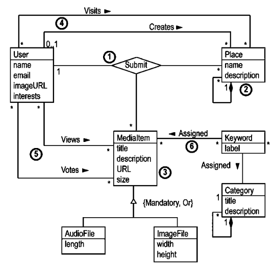
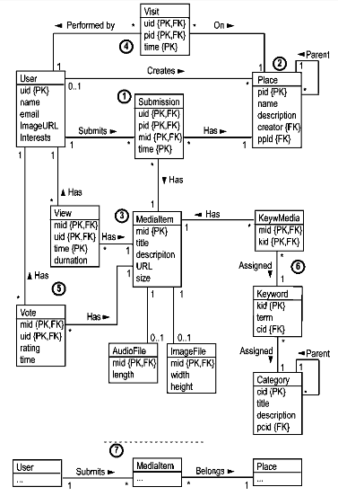

# بسم الله الرحمن الرحيم

## Lab-02 Solutions

### Task-02

Inthese tasks, **CAPS-TEXT** represents an **entity/noun** and **underlined-text** represents an **operation/verb**.

1. A USER can submit a PHOTOGRAPH or AUDIO RECORDING for a PLACE.
2. A USER can browse a DIRECTORYof PLACES of arbitrary depth and breadth.
3. A USER can find a particular PLACE or PHOTOGRAPH by a KEYWORD.
4. A USER can find PHOTOGRAPHS that are similar to another PHOTOGRAPH.
5. A USER can browse a timeline and discover PLACES or PHOTOGRAPHS.
6. A USER can vote on the quality of a PLACE or PHOTOGRAPH.
7. A USER can discover the most popular PLACES or PHOTOGRAPHS.
8. A USER can find similar USERS.
9. A USER can comment on a PLACE or PHOTOGRAPH.
10. A USER’S BEHAVIOR is trackedand recorded for future analysis.

### Conceptual Model

Next figure shows a target conceptual model for History Places.

1. At (1) a ternary relationship is used to model the idea that Users submit Media Items to Places.
2. At (2), a Place is modeled as a named entity with zero or more subplaces. There cursive  relationship  is  shown  as  an  aggregation  type  to  indicate  a  strong whole-part coupling between a parent and its children.
3. At (3), a Media Item is modeled as a general entity that must be specialized as either an Audio File or ImageFile.
4. At (4), binary relationships are used to model the idea of visiting places and creating new places. The Visits relationship is many-to-many,whereas the Creates relationship is one-to-many. To allow for the case wherea Place is created by the system, the participation constraint is shown as op-tional.
5. At (5), two binary relationships are shown to model the View and Vote operations.
6. Finally, at (6), entities are shown to model the assignment of key-words to MediaItems from a controlled vocabulary which is structured in a treeusing the same pattern as used to model Places.

- [Note] Of course, this conceptual model is one of many plausible solutions.

### Logical Model

As shown in the previous figure, the logical model is a relatively straight forward translation of the conceptual model. One interesting issue is deciding how to treat the ternary relationship.

1. At (1), a general solution is shown where the relationshipis modeled as an entity to allow for a user or group of users to submit an item toa place. Further, the item might simultaneously reside in several places. This is clearly more expressive than required, but it is also perhaps more natural because of the simple mapping between complex relationship and entity. An alternative solution is to relate the entity MediaItem to User and Place with one-to-many relationships as shown at (7) at the bottom of the figure.
2. At (2), the unary relationship is modeled using a single entity and with a foreign key to the entity’s primary key.
3. At (3), the superclass and its subclasses are modeled inthree tables with keys from a common domain allowing the tables to be joined.
4. At (4) and (5), the many-to-many relationships are reduced to one-to-many relationships with corresponding weak entities. The other features of the modelare relatively straightforward.