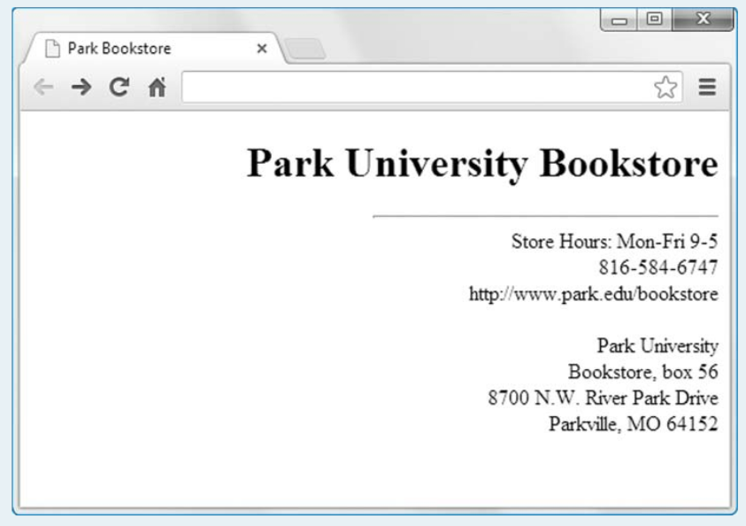
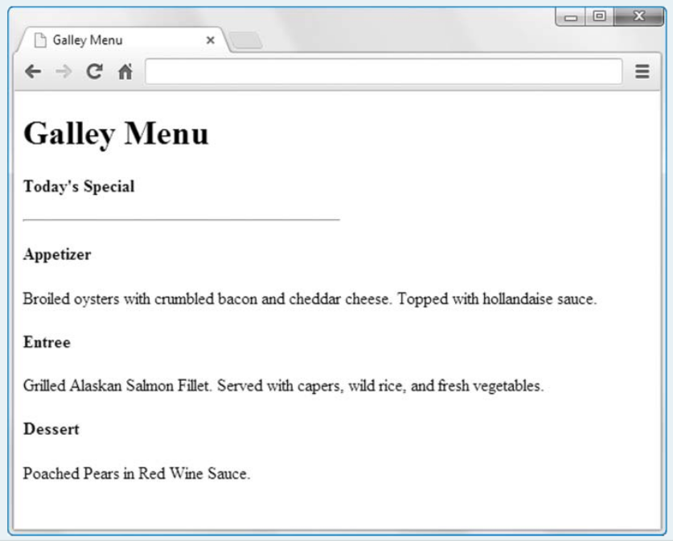

# بسم الله الرحمن الرحيم

## Lab-01

- Create the following web page, and name the file parkBookstore.html . Note that the horizontal line is right aligned. To implement that effect, use the margin-right CSS property with a value of 0 .

- Create the following web page, and name the file galleyMenu.html . As always, use heading elements for all headings, not just the ones that appear at the top of the page. Note that the horizontal line is left aligned. To implement that effect, use the margin-left CSS property with a value of 0.

