# بسم الله الرحمن الرحيم

## Unordered Lists

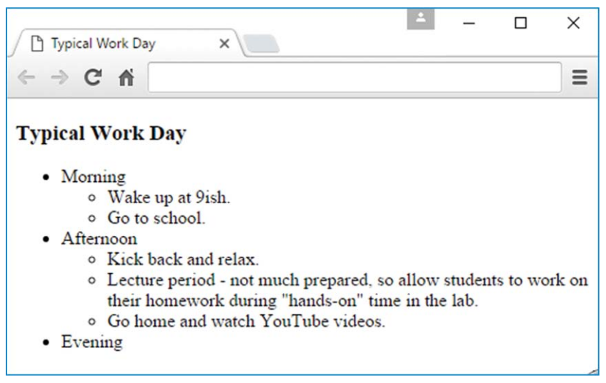

```html
<ul>
<li>Wake up at 9ish.</li>
<li>Go to school.</li>
</ul>
```

```html5
<ul>
<li>Wake up at 9ish.
<li>Go to school.
</ul>
```

### Parent and Child Element

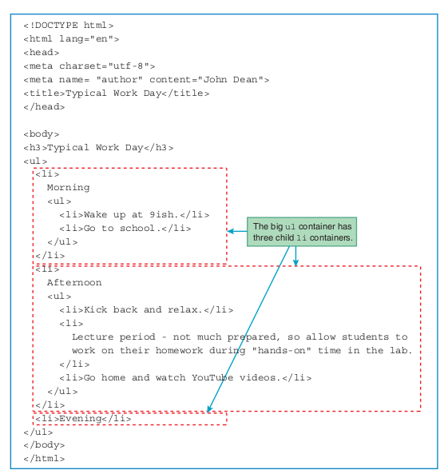

### Nested Lists

```html
<ul>
<li>Morning</li>
<ul>
<li>Wake up at 9ish.</li>
<li>Go to school.</li>
</ul>
```

### Symbols for unordered list items

```html
<style>
ul {list-style-type: circle;}
ul ul {list-style-type: square;}
</style>
```

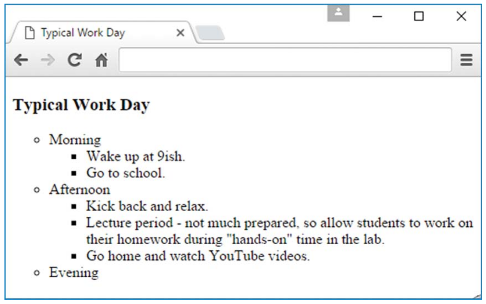

## Descendant Selectors

A descendant selector is when you specify a series of two or more selectors separated by spaces. For each pair of adjacent selectors, the browser searches for a pair of elements that match the selectors such that the second element is contained within the first element’s start tag and end tag. When an element is inside another element’s start tag and end tag, we say that the element is a descendant of the outer element.

To better understand the descendant selector, let’s look at an example. The following structure shows how the Work Day web page’s ul and li elements are related:

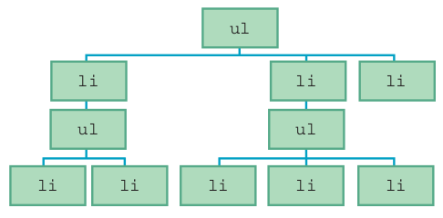

The `ul` element at the top is for the outer list. The three li elements below it are for the morning, afternoon, and evening list items.

```css
space-separated-list-of-elements { property1 : value ; property2 : value ;}
```

```html
<style>
ul {list-style-type: disc;}
ul ul {list-style-type: square;}
ul ul ul {list-style-type: none;}
</style>
```

```css
p dfn {font-style: italic;}
```

## Ordered Lists

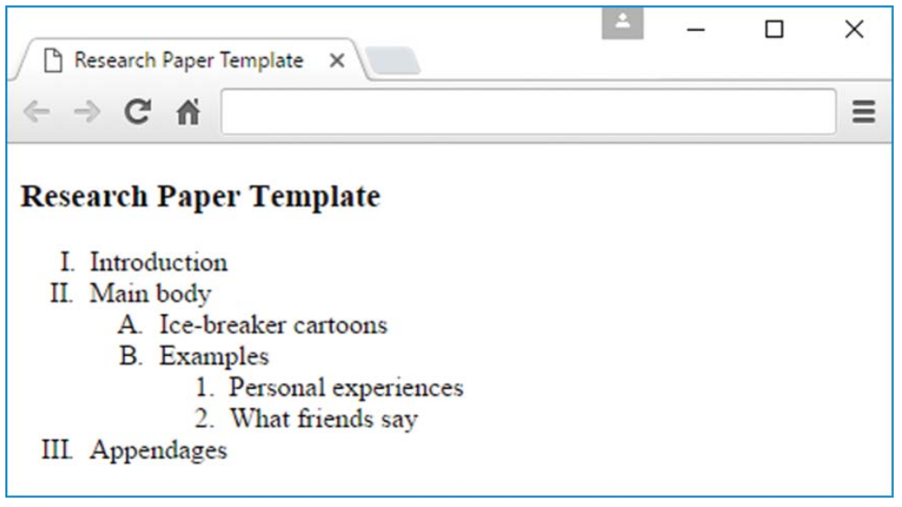

```html
<ol>
<li>Personal experiences</li>
<li>What friends say</li>
</ol>
```

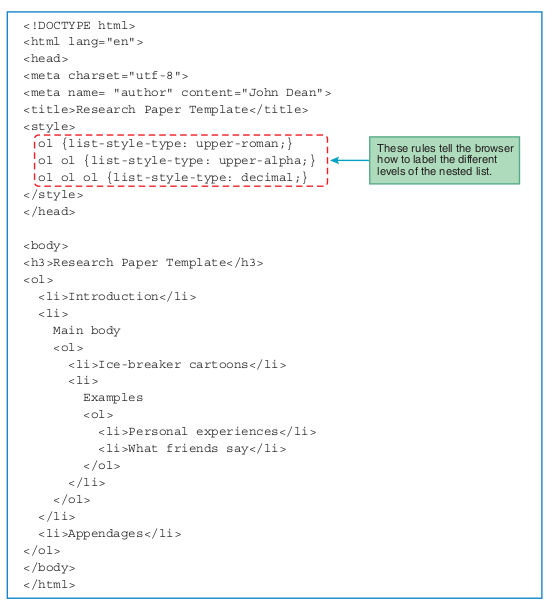

```html
<body>
Top Three Least-Loved Christmas Stories
<ol reversed>
<li>Jack Frost Loses the Feeling in His Extremities</li>
<li>I Saw Rudolph Kissing Santa Claus</li>
<li>The Teddy Bear Who Came to Life and Mauled a Retail Clerk</li>
</ol>
</body>
```

```html
<style>
.roman-list {list-style-type: upper-roman;}
</style>
...
<body>
Super Bowl host cities starting in 2019
<ol class="roman-list" start="52">
<li>Atlanta, Georgia</li>
<li>Miami, Florida</li>
<li>Wakeeny, Kansas</li>
</ol>
</body>
```

## Figure with a Code Fragment

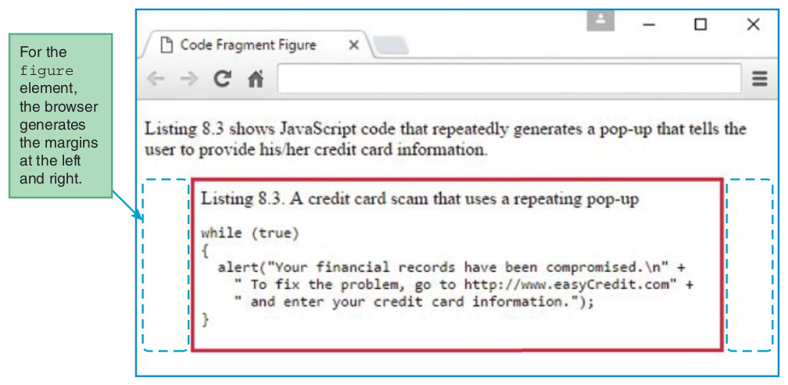

```css
figure {
border: solid crimson;
padding: 6px;
}
```

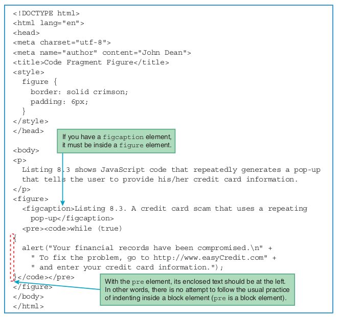

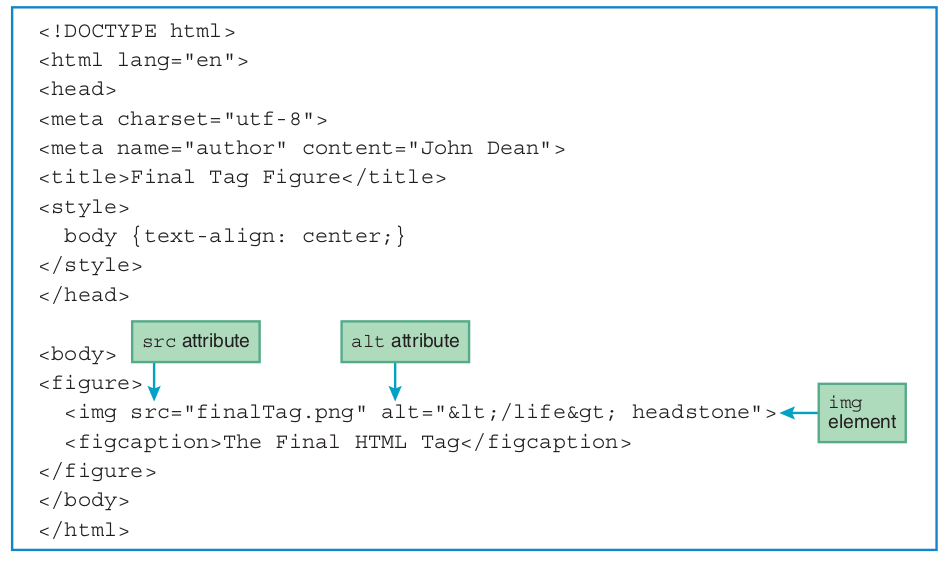

## Organizational Elements

Organizational elements that don’t have obvious physical manifestations. Their purpose is to group web page content into sections so that you can use CSS and JavaScript to manipulate their content more effectively. Here are the organizational elements you’ll be introduced to:

- section
- article
- aside
- nav
- header
- footer

There’s usually no need to use these organizational elements for small web pages, but when you have a multipage website, you should try to use them consistently.

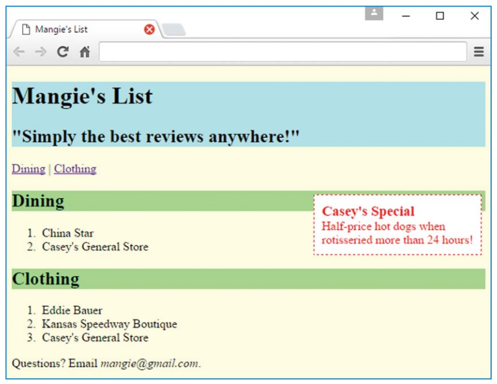

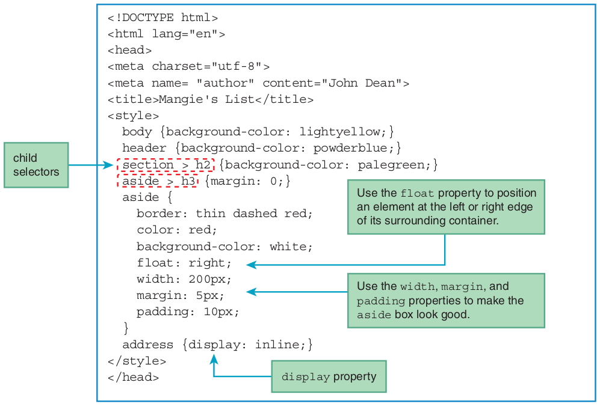

**Question**
What is the difference between Descendant and Child Selectors?

**Answer**

Just think of what the words "child" and "descendant" mean in English:
- My daughter is both my child and my descendant
- My granddaughter is not my child, but she is my descendant.

**Question**

To match the following `div p` we need to use:
1. Descendant Selector
2. Child Selector?

```html
<div><table><tr><td><p>
```

**Answer**

Descendant Selector

## `section` `article`

- `section` element is a container. It’s used to group together a section of a web page.
- `article` element is for grouping together one or more sections such that the group of sections form an independent part of a web page.
- `aside` element purpose is to group together content that has something to do with the rest of the web page, but it isn’t part of the main flow.

```css
aside {
border: thin dashed red;
color: red;
background-color: white;
float: right;
width: 200px;
margin: 5px;
padding: 10px;
}
```

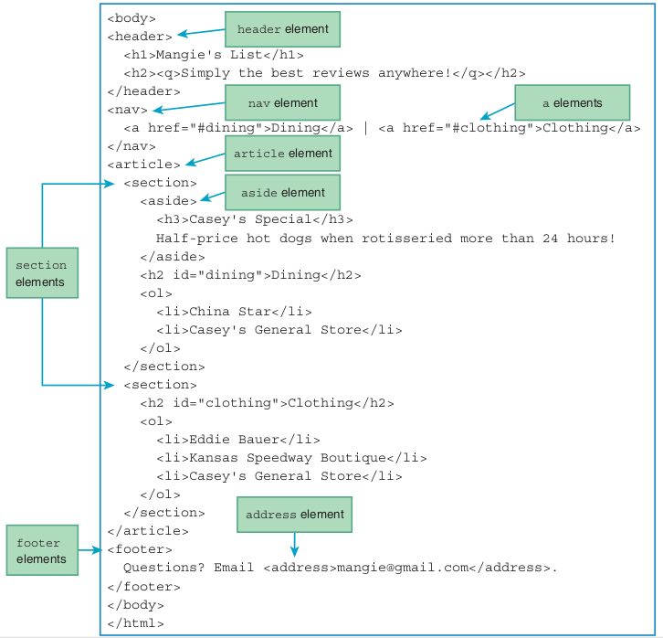

## `nav` `a`

- The `nav` element is a container that normally contains links to other web pages or to other parts of the current web page.
- Each `a` element implements a link. When the user clicks on a link, the browser jumps to the value specified by the href attribute.

```html
<nav>
<a href="#dining">Dining</a> | <a href="#clothing">Clothing</a>
</nav>
```

- The `#` indicates that the target is within the current web page.

```html
<h2 id="dining">Dining</h2>
```

## `header`

- The header element is for grouping together one or more heading elements ( h1 - h6 )
- Normally, the header is associated with a section , an article , or the entire web page.

```html
<style>
header {background-color: powderblue;}
...
</style>
<header>
<h1>Mangie's List</h1>
<h2><q>Simply the best reviews anywhere!</q></h2>
</header>
```

Alternative css

```css
h1, h2 {background-color: powderblue;}
```

## `footer`

- footer holds content such as copyright data, author information, or related links
- we use a footer element for contact information

```html
<footer>
Questions? Email <address>mangie@gmail.com</address>.
</footer>
```

## `display` Property

- The `address` element is a block element, so by default, browsers display it on a line by itself.
- But sometimes (actually, pretty often), you’re going to want to display an address in an inline manner within a sentence.

```css
address {display: inline;}
```

- The formal term for a browser’s native default settings is a user agent style sheet, where user agent is the formal name for a browser.
- A user agent style sheet forms the lowest priority rung in the cascade of places where CSS rules can be defined.

## Child Selectors

- The `>` symbol is called a combinator.

```css
list-of-elements-separated-with->’s { property1 : value ; property2 : value ;}
```

```css
section > h2 {background-color: palegreen;}
```

## What Happens When There Are Conflicting CSS Rules

## CSS Inheritance

- a CSS property value flows down from a parent element to one or more of its child elements. That should sound familiar. It parallels the inheritance of genetic characteristics (e.g., height and eye color) from a biological parent to a child.
- Some CSS properties are inheritable and some are not. To determine whether a particular CSS property is inheritable, go to Mozilla’s list of CSS keywords at <https://developer.mozilla.org/en-US/docs/Web/CSS/Reference> and click on the property you’re interested in. That should take you to a description of that property, including its inheritability.
- Of the CSS properties covered so far in this book, here are the ones that are inheritable:
  - color
  - font (and all of its more granular properties, like font-size )
  - line-height
  - list-style (and all of its more granular properties, like list-style-type )
  - text-align
  - text-transform

```html
<aside>
<h3>Casey's Special</h3>
Half-price hot dogs when rotisseried more than 24 hours!
</aside>
```

```css
aside {
border: thin dashed red;
color: red;
background-color: white;
float: right;
width: 200px;
padding: 10px;
margin: 5px;
}
```

- Inheritance is blocked for an inheritable property when an element explicitly specifies a new value for that property.

### Lab-03

### Lab-04

### Lab-05