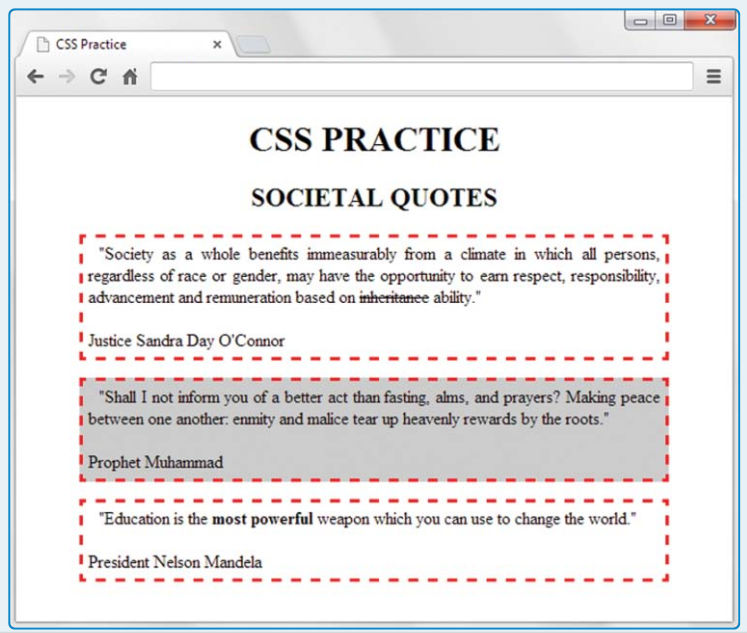
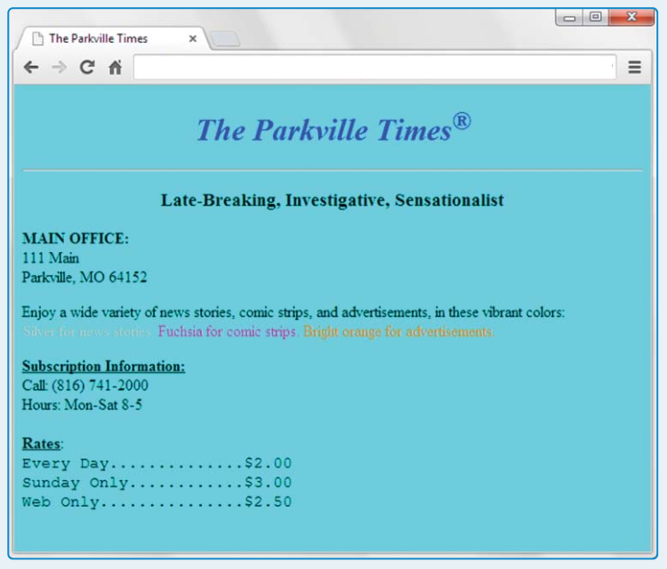

# بسم الله الرحمن الرحيم

## Project

Provide complete code for an implementation of the following web page and name the file cssPractice_societalQuotes.html



You must use the HTML body container code provided (you are not allowed to modify it). To support the HTML body container code, you must include a style container. Your style container must:
- Implement an appropriate type selector rule that would apply to all possible heading elements (not just the ones shown).
- Implement appropriate class selector rules with bold and strike-through selectors.
- Implement an appropriate type.class selector rule for `p` elements that use a
gray-background selector.
- Implement a type selector rule for all p elements. The rule should specify:
  - A 5-pixel padding
  - 50-pixel left and right margins
  - A dashed red border
  - Times New Roman or serif font text that is justified with both the left and right sides
  - 10-pixel indentation

**Hint**

```html
<body>
<h1>css practice</h1>
<h2>societal quotes</h2>
<p>
"Society as a whole benefits immeasurably from a climate in
which all persons, regardless of race or gender, may have the
opportunity to earn respect, responsibility, advancement and
remuneration based on <span class="strike-through">inheritance</span>
ability."
<br><br>
Justice Sandra Day O'Connor
</p>
<p class="gray-background">
"Shall I not inform you of a better act than fasting, alms, and
prayers? Making peace between one another: enmity and malice tear
up heavenly rewards by the roots."
<br><br>
Prophet Muhammad
</p>
<p>
"Education is the <span class="bold">most powerful</span>
weapon which you can use to change the world."
<br><br>
President Nelson Mandela
</p>
</body>
```

## Project



The window background must render using the color cyan. The top heading must render using the color blue. For the sake of getting practice with different color value formats, you must use different techniques to specify each of the three color messages:
- silver—use an HSL value
- fuchsia—use a hexadecimal RGB value
- bright orange—use an integer RGB value