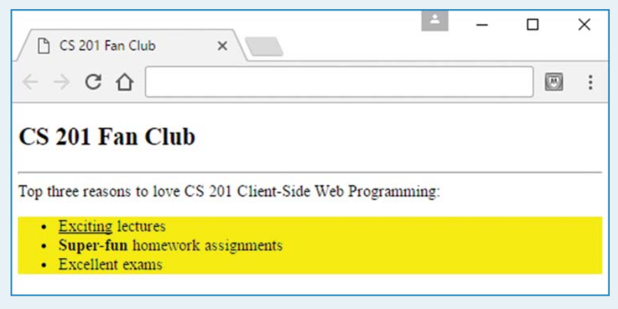

# بسم الله الرحمن الرحيم

**Question 01**

- Provide a style container that could be used to produce this web page:



Your style container must:
- Implement an appropriate type selector rule that renders the outline with a yellow background color.
- Implement appropriate class selector rules for the underlined and boldfaced words.
- Your style container must work in conjunction with the following body container. You are to use the body container as is; you are not allowed to modify it.

```html
<body>
<h2>CS 201 Fan Club</h2>
<hr />
<div>
Top three reasons to love CS 201 Client-Side Web Programming:
<ul>
<li><span class="underlined">Exciting</span> lectures</li>
<li><span class="superFun">Super-fun</span> homework assignments</li>
<li>Excellent exams</li>
</ul>
</div>
</body>
</html>
```

**Question 02**
Assuming the rest of the web page’s code is valid, the following code
fragments generate a nested list with three borders.
- Describe what each of the three borders surrounds (for your description, it’s OK to provide only a screenshot).
- For each rule, describe which element(s) the rule applies to.

```html
<style>
ul li {border-style: solid;}
ul > li {border-color: red;}
</style>
<body>
<ul>
<li>one</li>
<li>two
<ol>
<li>three</li>
</ol>
</li>
</ul>
</body>
```

**Question 03**

Assuming the rest of the web page’s code is valid, the following code fragments generate a nested list.
- Describe the font size and color for each of the three list items (for your description, it’s OK to provide only a screenshot).
- For each rule, describe which element(s) the rule affects and whether the effect comes from the rule directly matching that element or whether it comes from CSS inheritance.

```html
<style>
ol > li {font-size: 200%;}
ul {color: blue;}
.green {color: green;}
</style>
<body>
<ul>
<li>one
<ol>
<li>two
<ul>
<li class="green">three</li>
</ul>
</li>
</ol>
</li>
</ul>
</body>
```