# بسم الله الرحمن الرحيم

## Tables

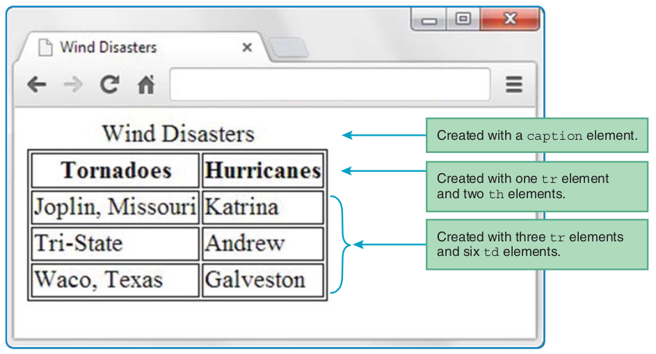

- Display Caption at the bottom

```css
caption {caption-side: bottom;}
```

## Formatting a Data Table: Borders, Alignment, and Padding

```css
table, th, td {border: thin solid;}
```

- `border` is a shorthand property that handles a set of border-related properties.

```css
th, td {
text-align: left;
padding: 10px;
}
```

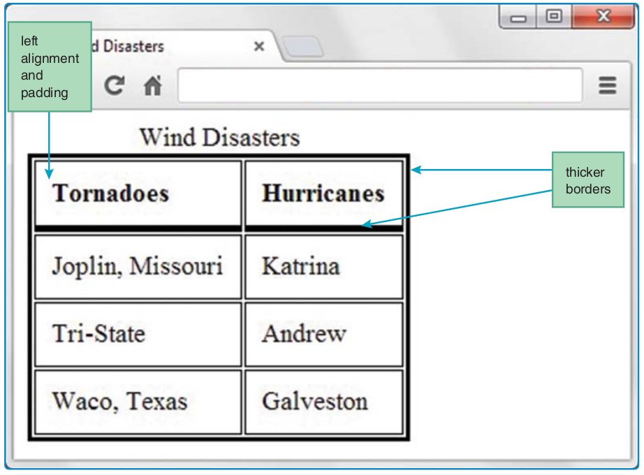

```css
table, th, td {border: thin solid;}
```

To assign a medium width to the table's outer border and assign a thick width to the header cell's bottom borders

```css
table {border-width: medium;}
th {border-bottom-width: thick;}
```

If you’d like to eliminate those gaps and merge the borders, use the `border-collapse` CSS property with a value of `collapse` , like this:

```css
table {border-collapse: collapse;}
```

The default value for `border-collapse` is `separate` , and the separate value causes gaps to appear between adjacent borders.

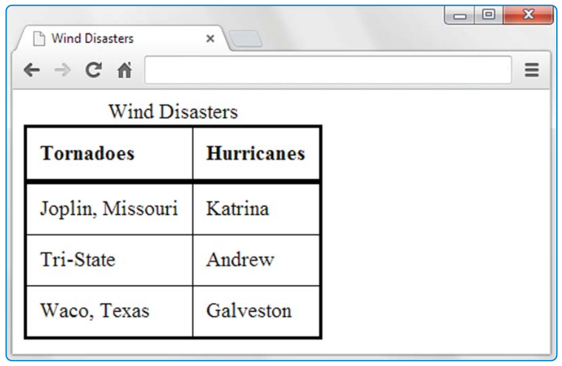

## CSS Structural Pseudo-Class Selectors

The following code uses a standard `tr` type selector to select all the `tr` elements in a web page, and the `:first-of-type` pseudo-class checks each of those elements to see if it is a first `tr` element within a particular table:

```css
tr:first-of-type {background-color: palegreen;}
```

A pseudo-class is called a “pseudo-class” because using a pseudo-class is similar to using a class attribute, but the two entities are not identical. A pseudo-class is like a class selector in that it matches particular instances of elements (that’s what happens with elements that use class attributes). But they are different from class selectors in that they don’t rely on the class attribute.

**Demo**

```css
tr:nth-of-type(even) {background-color: lightblue;}
```

```css
tr:nth-of-type(5n+2) {background-color: red;}
```

That rule selects every fifth tr element starting with the second row. In other words, it selects rows 2, 7, 12, 17, and so on.

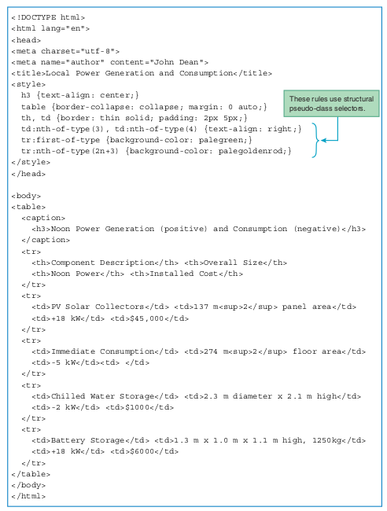

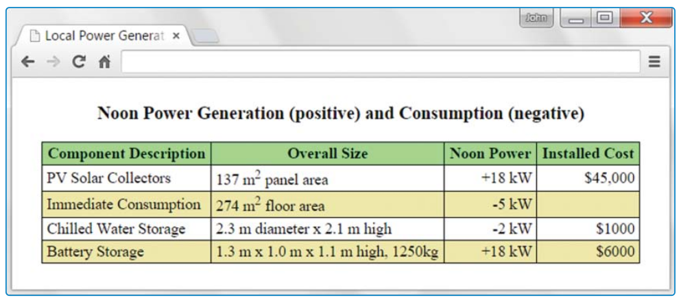

## `thead` and `tbody` Elements

**Demo**

- Open Page temperatures.html - Chapter 05

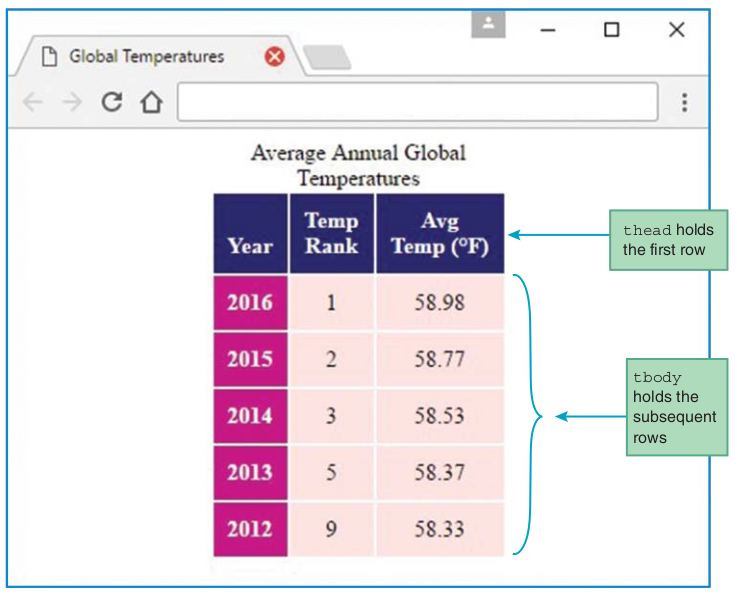

```css
thead th {background-color: midnightblue;}
tbody th {background-color: mediumvioletred;}
```

```css
body {display: flex; justify-content: center;}
```

flexbox layout is fairly new (the W3C introduced it to its CSS specification in
2016), older browsers don’t support it. Therefore, you should be familiar with this alternative technique, which is pervasive throughout the web page universe:

```css
table {margin: 0 auto;}
```

```css
table, th, td {border: none;}
```

The `border: none` property-value pair means that the browser will not draw border lines. That means the web page’s background color appears where the border lines would normally appear.

```css
thead th {vertical-align: bottom;}
```

Using a bottom value for the vertical-align property causes a cell’s text to be aligned at the bottom. If you need top or middle vertical alignment, use the vertical-align property with a value of top or middle , respectively.

## Cell Spanning

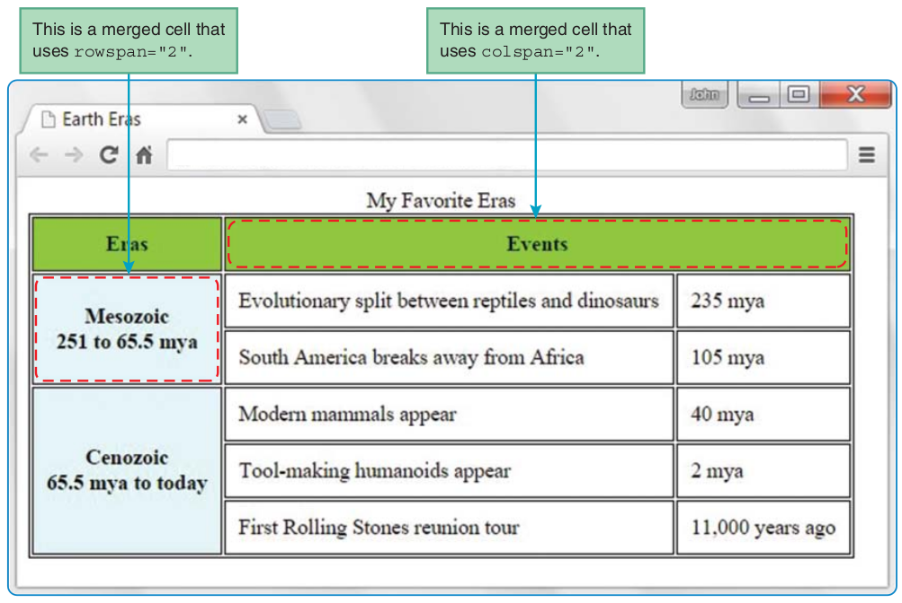

```html
<tr><th>Eras</th><th colspan="2">Events</th></tr>
```

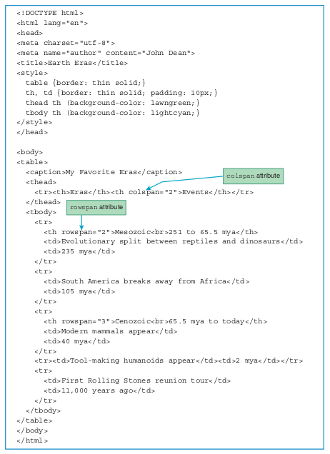

```html
<tr>
<th rowspan="2">Mesozoic<br>251 to 65.5 mya</th>
<td>Evolutionary split between reptiles and dinosaurs</td>
<td>235 mya</td>
</tr>
```

## Web Accessibility

- Web accessibility means that disabled users can use the Web effectively.
- Most web accessibility efforts go toward helping users with visual disabilities, but web accessibility also attempts to address the needs of users with hearing, cognitive, and motor skills disabilities.
- Many countries have laws that regulate accessibility for websites. For example, <https://www.access-board.gov/guidelines-and-standards/communications-and-it> describes web accessibility guidelines that U.S. government agencies are required to follow.
- A *screen reader* is software that figures out what the user’s screen is displaying and sends a text description of it to a speech synthesizer.
- The speech synthesizer then reads the text aloud.
- you should consider embedding a details element in the table’s caption element. The details element provides a description of the table’s content so that a screen reader can read the description and get a better understanding of the nature of the table’s organization.
- The HTML5 standard requires that you preface the details element’s text with a summary element.

## CSS display Property with Table Values

- Do not to use the table element for layout tables
- If you do so, you should use `role="presentation"` to avoid incurring the wrath of the W3C police.
- There are two main ways to implement layout tables with CSS
  - If you want the layout boundaries to grow and shrink the way they do for an HTML table element, then use the CSS display property with table values.
  - if you want the layout boundaries to be fixed (no growing or shrinking), then use CSS position properties.

### The `display` Property’s Table Values

```css
display: inline
```

- The display property can be used for much more than just inlining block element content.
- The table value enables an element, like a div element, to behave like a table.

**Demo**
- ancientWonders.html

```css
<style>
.table {display: table;}
...
</style>
<body>
<div class="table">
...
</div>
</body>
```

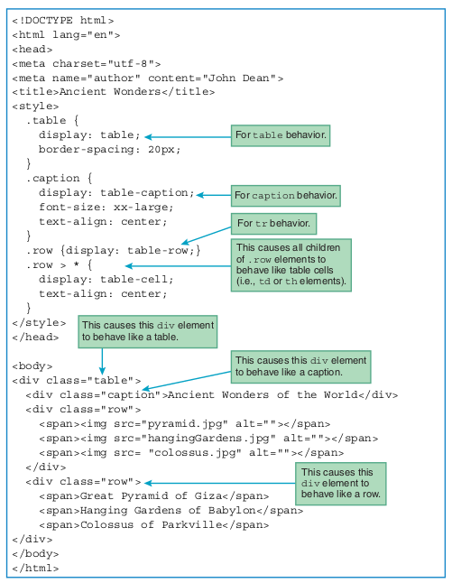

- The `>` symbol is known as a combinator because it combines two selectors into one.

#### The `border-spacing` Property

- By default, tables created with the display property are displayed with no gaps between their cells.
- For the Ancient Wonders web page, that default behavior would have led to pictures that were touching.
- To avoid that ugliness, you can use the border-spacing property, and that’s what we did in the Ancient Wonders style container:

```css
.table {
display: table;
border-spacing: 20px;
}
```

- The border-spacing property allows you to specify horizontal and vertical cell spacing separately. Here’s an example:

```css
border-spacing: 15px; 25px;
```

- The first value, 15px , specifies horizontal spacing, and the second value, 25px , specifies vertical spacing.
- `margin` property has no effect when used with elements that are defined to be table cells.

### Absolute Positioning with CSS Position Properties

- If you want table layout where content controls the size of the table’s cells, then use the CSS `display property` with `table` values.
- But if you want table layout where the table’s cell sizes are fixed, you should use CSS `position` properties.
- Ex. NewsPaper

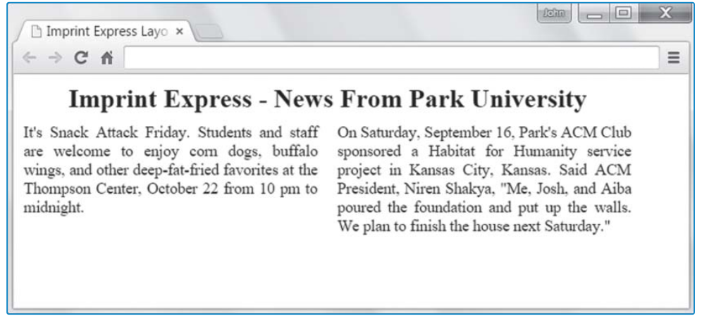

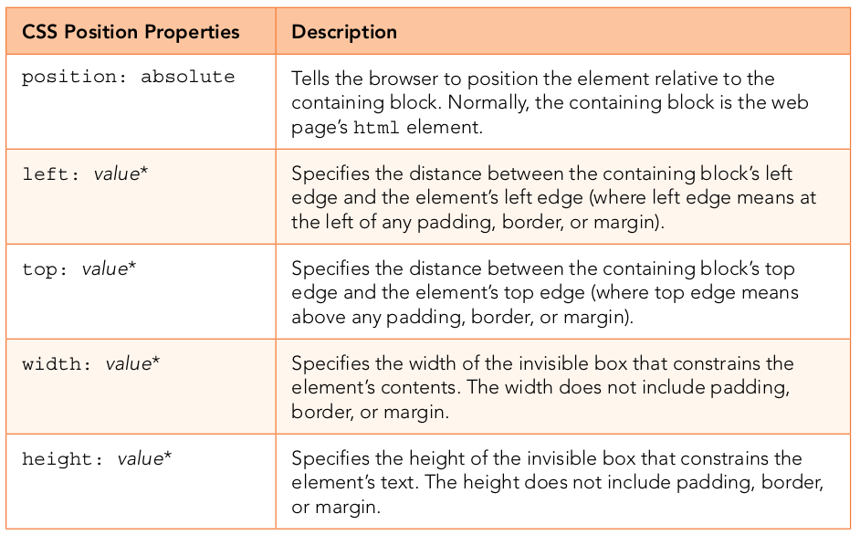

- Normally, when designing a web page with CSS position properties, you should start by drawing the layout using paper and a pencil.
- In your drawing, show pixel measurements for the dimensions of your web page’s regions

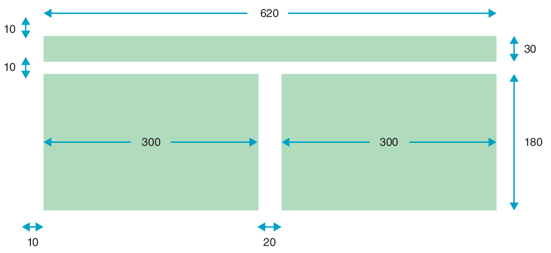

```css
.left-article {
position: absolute;
top: 50px; left: 10px;
width: 300px; height: 180px;
}

.right-article {
position: absolute;
top: 50px; left: 330px;
width: 300px; height: 180px;
}
```

- The problem with the rules shown is that there’s quite a bit of code redundancy.

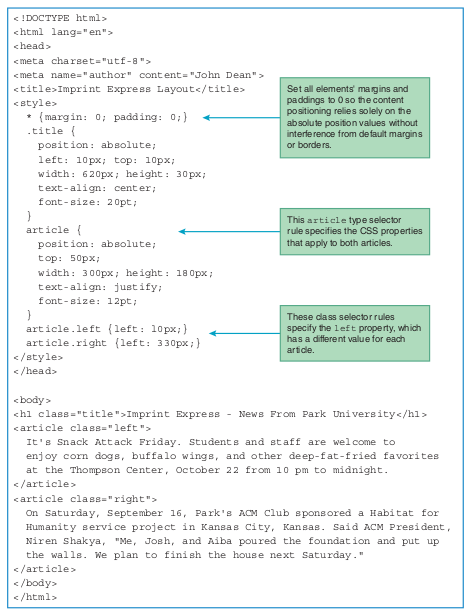

## Relative Positioning

- absolute positioning, where you specify position: absolute in a CSS rule in order to position an element relative to the top-left corner of its containing block.
- As an alternative, you can position an element relative to its normal flow within its surrounding content. That’s called relative positioning.

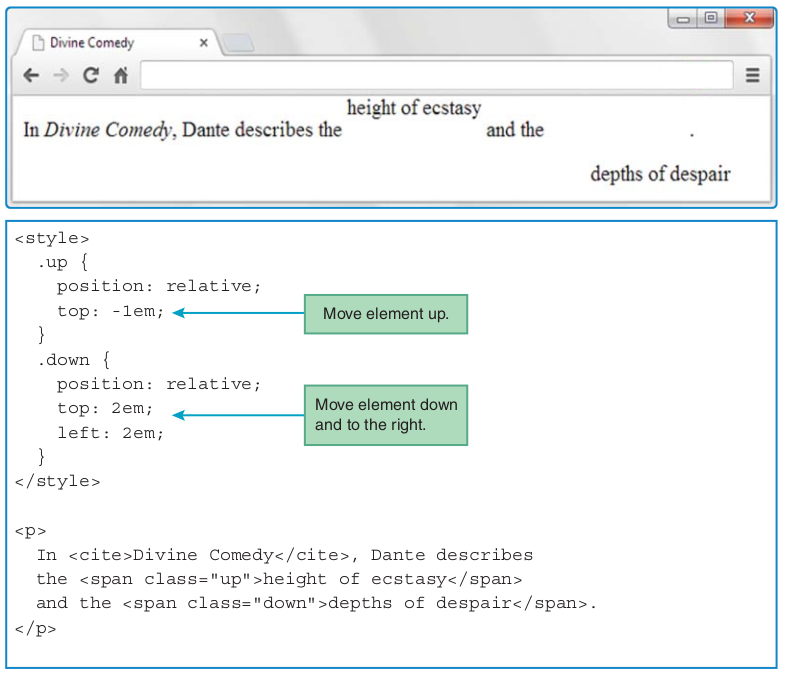

### Centering the Entire Page Within a Browser Window

- To make the NewsPaper page centered in the browser

```css
html {
display: flex;
justify-content: center;
}

body {
position: relative;
width: 620px;
height: 220px;
}
```

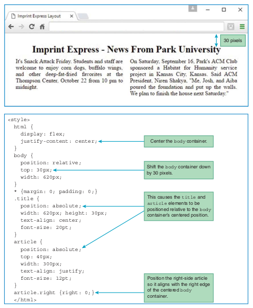

## Labs

- Lab-01
- Lab-02
- Lab-03