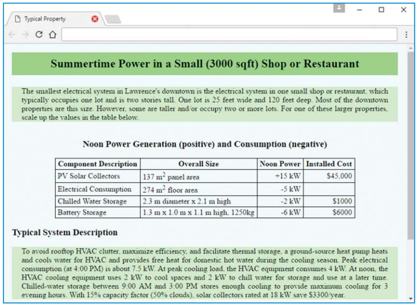
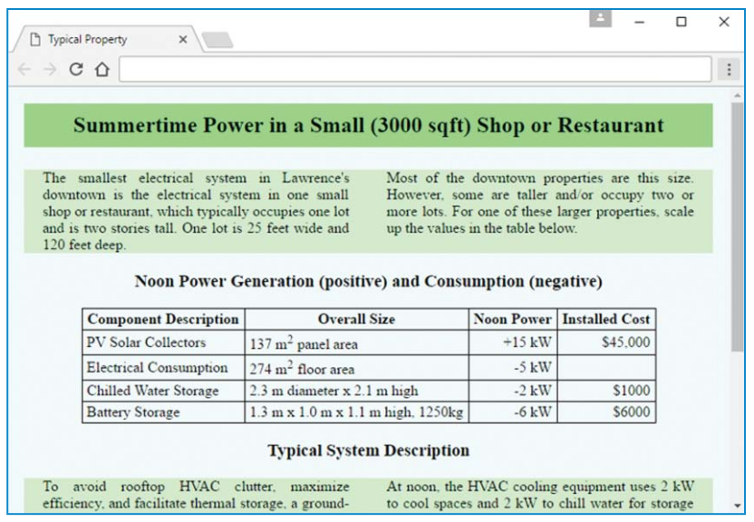

# بسم الله الرحمن الرحيم

## Lab-01




### Hints
- Microgrid.css - Chapter 03
```css
.center {
display: flex; justify-content: center;
}
table {border-collapse: collapse;}
th, td {
border: thin solid;
padding: 2px 5px;
}
td:nth-child(3), td:nth-child(4) {
text-align: right;
}
```

For our second design iteration, we’ll split each block of text into two columns by replacing each p element in the first iteration with a div element containing a pair of subordinate div elements—one for each column. Thus, for example, for the first block of text, instead of using this:

```html
<p>
The smallest electrical system in Lawrence’s downtown ...
... values in the table below.
</p>
We’ll use this:
<div class="row">
<div class="cell">
The smallest electrical system in Lawrence’s downtown ...
... occupies a single lot.
</div>
<div class="cell">
One lot is 25 feet wide and 120 feet deep. Most of the ...
... values in the table below.
</div>
</div>
```
This requires two CSS rules. So the style element at the top of the web page will get these two additional components:

```css
.row {
display: table-row;
}
.cell {
display: table-cell;
width: 40%;
padding: 0px 20px;
text-align: justify;
}
```