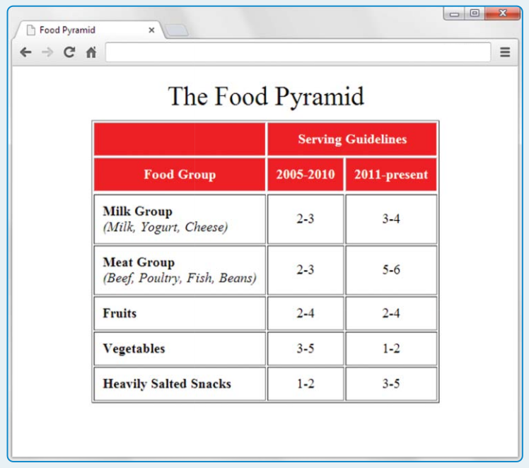

# بسم الله الرحمن الرحيم

## Project

Create the following web page and name the file foodPyramid.html

Note:

- Use a `table` element with appropriate other elements, including `thead` and `tbody` elements.
- The table should be horizontally centered with respect to the browser window.
- Look carefully—padding has been added to the table’s caption.